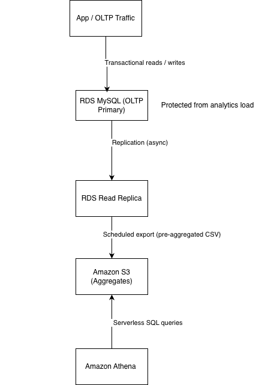

## OLTP + Analytics Offload on AWS (RDS MySQL → S3 → Athena)

### Goal

Protect OLTP latency by preventing analytics/reporting queries from competing with transactional workload. Instead of scaling the OLTP database, analytics are offloaded to an independent query layer.

## Architecture Diagram

This architecture separates transactional (OLTP) workloads from analytics by exporting pre-aggregated data from a read replica into S3, where it is queried using Athena. Analytics queries never touch the OLTP primary.

## Architecture

- **OLTP path**: Application traffic performs transactional reads and writes against an RDS MySQL primary.
- **Isolation layer**: An RDS read replica is used for analytics-safe reads and scheduled exports.
- **Analytics storage**: Pre-aggregated CSV data is written to Amazon S3.
- **Query layer**: Amazon Athena runs serverless SQL queries directly against S3.
- **Design guarantee**: Analytics workloads never compete with OLTP traffic.

### What I proved

- Workload separation: analytics queries do not hit the OLTP instance
- Design tradeoffs: offload vs scale-up, RDS vs Aurora, Athena vs Redshift
- Pipeline impact awareness: exports are consumers of DB resources, so they run against the replica

### Evidence

- Athena preview of exported aggregates: `screenshots/athena_orders_agg_preview.png`
- Athena revenue-by-day query results: `screenshots/athena_revenue_by_day.png`

### Lessons Learned

- Managed services like Athena may retain execution metadata that requires explicit cleanup or state reconciliation during teardown.

### Cleanup

This lab is designed to be fully destroyable to avoid ongoing AWS cost.
